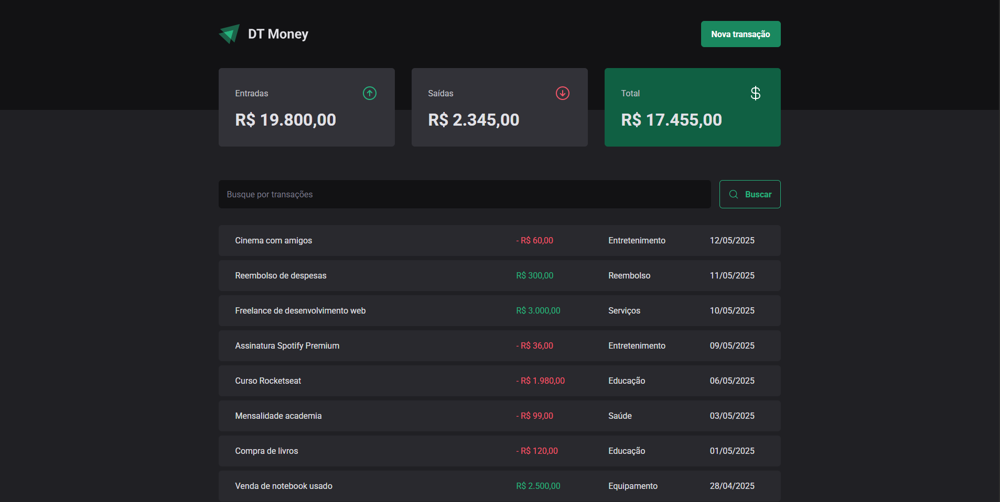
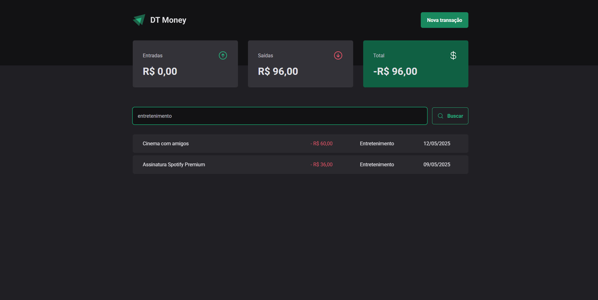
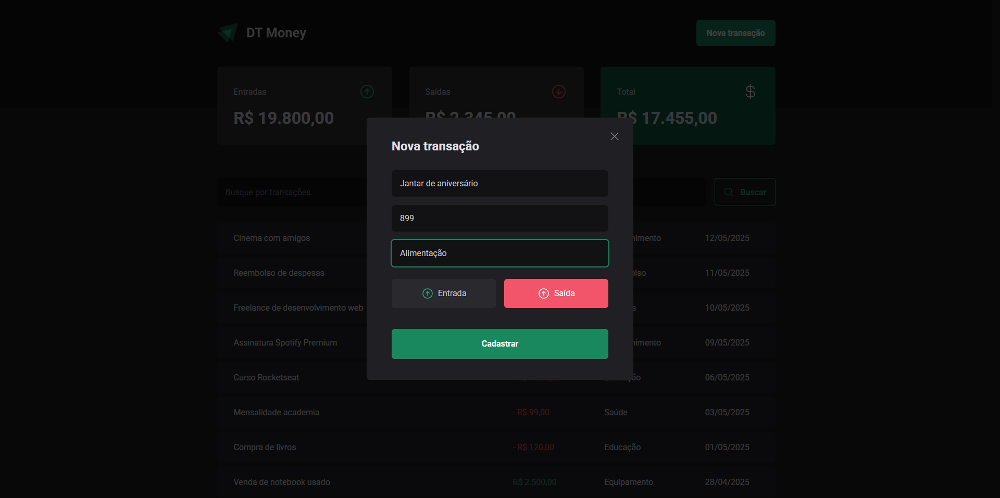

# DT Money

This was the project developed in level 03 of Rocketseat's React course.

## Table of contents

- [Overview](#overview)
  - [Screenshots](#screenshots)
- [How to Run the Project](#how-to-run-the-project)
- [Developed with](#developed-with)
- [Author](#author)

## Overview

This application is designed to help users manage their personal finances with ease. It allows users to log financial transactions, categorizing each entry as income or expense and assigning relevant values and labels. The app also features powerful search and filter capabilities, enabling users to quickly find specific records based on their preferences. During development, JSON Server was used to simulate real API interactions, ensuring a realistic testing environment.

### Screenshots

#### Desktop design

### Initial State


### Search transactions


### Adding a new transaction


## How to Run the Project

To run the project locally, follow these steps:

1. Clone the repository:
   ```bash
   git clone "https://github.com/itsdavss/dt-money"

2. Navigate to the project folder:
   ```bash
   cd dt-money

3. Install the dependencies:
   ```bash
   npm install

4. Start the development server:
   ```bash
   npm run dev

## Developed with

- Typescript 
- React
- API
- JSON Server
- Radix UI
- Styled Components
- Contexts
- React Hook Form
- Zod

## Author

- GitHub - [itsdavss](https://github.com/itsdavss)
- My portfolio - [Davi Oliveira](https://itsdavss.github.io/portfolio-davi/)
